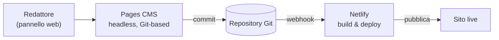

<div align="center">

# Onoranze Funebri Melotti — Funeral Home Website

**Sito web su misura per un'impresa di onoranze funebri, realizzato da zero in HTML/CSS/JavaScript puri e gestito tramite un CMS headless su Git con deploy continuo.**

*A bespoke, responsive website for an Italian funeral home — built from scratch in vanilla HTML/CSS/JS and powered by a headless, Git-based CMS with continuous deployment.*

<br/>


[](https://lauratonsi.github.io/Onoranze_Melotti_Website/)

🇮🇹 [Italiano](#-italiano) · 🇬🇧 [English](#-english)

</div>

> ⚠️ **Versione demo / Demo version** — I nomi e le foto dei defunti sono **fittizi** per tutela della privacy; il sito di produzione (dati reali) è privato.
> *Names and photos of the deceased are **fictional placeholders** for privacy; the production site with real data is private.*

<br/>


---

## 🏗 Architettura / Architecture

I contenuti si aggiornano da un **pannello web** — senza toccare file né codice — e ogni modifica va online **da sola**.
*Content is edited from a web panel — no files, no code — and every change ships automatically.*



Nessuna build manuale, nessun FTP: **CMS → Git → CI/CD → produzione**.

---

## 🇮🇹 Italiano

### Panoramica
Progetto full-stack *front-end* per Onoranze Funebri Melotti (Edolo, BS): un sito elegante e sobrio,
pensato per un contesto delicato, con un'esperienza di lettura curata e un sistema di gestione dei
necrologi semplice da usare per personale **non tecnico**.

### ✨ Funzionalità principali
- **Design 100% su misura** — nessun template o page builder: layout, tipografia e micro-animazioni originali.
- **Sistema necrologi headless** — schede dinamiche (ritratto + manifesto completo in lightbox), link al
  luogo di riposo, **ordinamento automatico per data**; contenuti *data-driven* da `data/necrologi.json`.
- **CMS senza codice** — i necrologi si gestiscono da un pannello web (**Pages CMS**) sul repository Git,
  con **deploy automatico su Netlify** ad ogni salvataggio: chi aggiorna il sito non tocca file né codice.
- **Performance** — pipeline di ottimizzazione immagini (≈ 80 MB → 15 MB), font *self-hosted* (zero
  chiamate a terze parti), media in *lazy loading*, animazioni allo scroll via `IntersectionObserver`.
- **Integrazioni** — Google Maps (scheda attività), WhatsApp e telefono click-to-call, Instagram/Facebook,
  recensioni Google/Facebook, video player inline, form contatti (Netlify Forms, senza backend).
- **GDPR (in produzione)** — banner di consenso cookie (Iubenda), privacy & cookie policy, mappe di
  terze parti **bloccate fino al consenso**.
- **Accessibile & responsive** — HTML semantico, attributi ARIA, ottima resa da mobile a desktop.

### 🔧 Scelte tecniche
- **Zero dipendenze a runtime**: JavaScript *vanilla* scritto a mano, nessun framework, bundle minimo.
- **Rendering data-driven**: le schede sono generate da un unico JSON, con ordinamento lato client.
- **Deploy continuo**: repository Git → Netlify, con anteprime automatiche e rollback immediato.
- **Robustezza**: fallback grafico per immagini mancanti, degradazione elegante senza JS.

---

## 🇬🇧 English

### Overview
A front-end project for an Italian funeral home (Edolo, BS): an elegant, restrained website designed for
a sensitive context, with a carefully crafted reading experience and an obituary-management system that
**non-technical staff** can use with ease.

### ✨ Key features
- **100% custom design** — no templates or page builders; bespoke layout, typography and micro-animations.
- **Headless obituary system** — data-driven cards (portrait + full announcement in a lightbox),
  resting-place links, **automatic date sorting**; content lives in `data/necrologi.json`.
- **No-code CMS** — obituaries are managed from a web panel (**Pages CMS**) on the Git repo, with
  **automatic Netlify deploys** on every save: whoever updates the site never touches files or code.
- **Performance** — image optimization pipeline (≈ 80 MB → 15 MB), self-hosted fonts (zero third-party
  requests), lazy-loaded media, `IntersectionObserver` scroll-reveal animations.
- **Integrations** — Google Maps (business listing), click-to-call phone & WhatsApp, Instagram/Facebook,
  Google/Facebook reviews, inline video, contact form (Netlify Forms, no backend).
- **GDPR (production)** — cookie consent banner (Iubenda), privacy & cookie policy, third-party maps
  **blocked until consent**.
- **Accessible & responsive** — semantic HTML, ARIA attributes, great from mobile to desktop.

### 🔧 Engineering notes
- **Zero runtime dependencies**: hand-written vanilla JavaScript, no framework, minimal payload.
- **Data-driven rendering**: cards generated from a single JSON file, sorted client-side.
- **Continuous deployment**: Git repo → Netlify, with automatic deploy previews and instant rollback.
- **Resilience**: graceful image fallbacks and progressive enhancement without JS.

---

## 🛠 Tech stack

| Ambito | Tecnologie |
|---|---|
| **Front-end** | HTML5 semantico · CSS3 (custom properties, Grid & Flexbox) · JavaScript vanilla (ES modules) |
| **Contenuti** | Pages CMS (headless, Git-based) · dati in JSON |
| **Hosting & CI/CD** | Netlify (deploy continuo da Git, deploy previews) · Netlify Forms |
| **Tooling** | Ottimizzazione immagini · font self-hosted (Cormorant Garamond + Lato) |

## 📁 Struttura / Project structure

```
├─ index.html · su-di-noi.html · casa-del-commiato.html
├─ necrologi.html · servizi.html · contatti.html
├─ css/style.css          stili (design system con custom properties)
├─ js/                    main.js · necrologi.js · gallery.js
├─ data/necrologi.json    contenuti dei necrologi (fittizi in questa demo)
├─ .pages.yml             configurazione del CMS (Pages CMS)
├─ fonts/                 font self-hosted
└─ images/ · media/       risorse
```

## 🔒 Privacy
Questa è una **versione dimostrativa** con dati e immagini interamente inventati. Il sito reale,
con i dati delle famiglie assistite, è ospitato su un repository **privato** e non è pubblicato qui.

## 👩‍💻 Autrice / Author

**Laura Tonsi** — [github.com/lauratonsi](https://github.com/lauratonsi)
Progettazione, sviluppo e integrazione del CMS. / Design, development & CMS integration.
