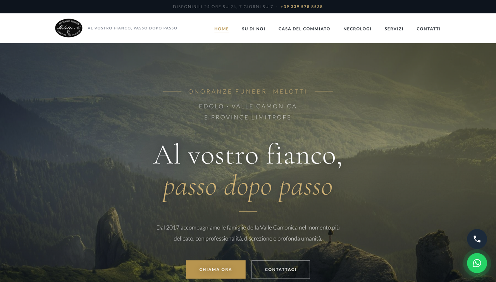
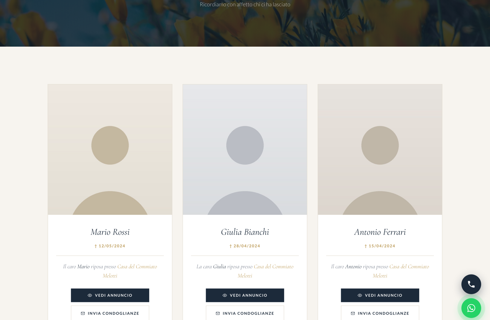

# Onoranze Funebri Melotti — Sito web / Funeral Home Website

🇮🇹 [Italiano](#-italiano) · 🇬🇧 [English](#-english)

### 🔗 [Demo live →](https://lauratonsi.github.io/Onoranze_Melotti_Website/)





---

## 🇮🇹 Italiano

Sito web su misura, responsive, progettato e sviluppato per un'impresa di onoranze funebri
(Onoranze Funebri Melotti — Edolo, BS), realizzato da zero con HTML, CSS e JavaScript puri.

> ⚠️ **Versione demo.** I nomi e le foto dei defunti sono stati sostituiti con
> **segnaposto fittizi** per tutela della privacy. Il sito di produzione (dati reali) è privato.

### In evidenza
- **Design 100% su misura** — nessun template o page builder: layout, tipografia e animazioni originali
- **Sistema necrologi headless** — schede dinamiche (ritratto + manifesto in lightbox), link al luogo di
  riposo, ordinamento automatico per data; contenuti **data-driven** da `data/necrologi.json`
- **CMS senza codice** — i necrologi si gestiscono da un pannello web (**Pages CMS**) sul repository Git,
  con **deploy automatico su Netlify** ad ogni modifica: chi aggiorna il sito non tocca file né codice
- **Performance** — pipeline di ottimizzazione immagini (≈ 80 MB → 15 MB), font self-hosted (nessuna chiamata esterna)
- **Integrazioni** — Google Maps (scheda attività), WhatsApp e telefono, Instagram/Facebook,
  recensioni Google/Facebook, video player inline
- **Form contatti** tramite Netlify Forms (senza backend)
- **GDPR (in produzione)** — banner di consenso cookie (Iubenda), privacy & cookie policy,
  mappe di terze parti bloccate fino al consenso
- **UX** — navbar sticky che si rimpicciolisce, animazioni allo scroll, galleria a mosaico, lightbox

### Tecnologie
`HTML5` · `CSS3` (custom properties, grid & flexbox) · `JavaScript vanilla` · `Pages CMS` (headless, Git-based) · `Netlify` (hosting, deploy continuo da Git, Forms)

### Struttura
```
index.html · su-di-noi.html · casa-del-commiato.html · necrologi.html · servizi.html · contatti.html
css/style.css        stili
fonts/               font self-hosted
js/                  main.js · necrologi.js · gallery.js
data/necrologi.json  dati dei necrologi (fittizi in questa demo)
.pages.yml           configurazione del CMS (Pages CMS)
images/ · media/     risorse
```

---

## 🇬🇧 English

Custom, responsive website designed and developed for an Italian funeral home
(Onoranze Funebri Melotti — Edolo, BS), built from scratch with vanilla HTML, CSS and JavaScript.

> ⚠️ **Demo version.** Names and photos of the deceased have been replaced with
> **fictional placeholders** for privacy. The production site (real data) is private.

### Highlights
- **100% custom design** — no templates or page builders; bespoke layout, typography and animations
- **Headless obituary system** — data-driven cards (portrait + full announcement in a lightbox),
  resting-place links, automatic date sorting; content lives in `data/necrologi.json`
- **No-code CMS** — obituaries are managed from a web panel (**Pages CMS**) on the Git repo,
  with **automatic Netlify deploys** on every change: whoever updates the site never touches files or code
- **Performance** — image optimization pipeline (≈ 80 MB → 15 MB), self-hosted fonts (no third-party calls)
- **Integrations** — Google Maps (business listing), WhatsApp & phone, Instagram/Facebook,
  Google/Facebook reviews, inline video player
- **Contact form** via Netlify Forms (no backend)
- **GDPR (production)** — cookie consent banner (Iubenda), privacy & cookie policy,
  third-party maps blocked until consent
- **UX** — sticky shrinking navbar, scroll-reveal animations, responsive mosaic gallery, lightbox

### Tech stack
`HTML5` · `CSS3` (custom properties, grid & flexbox) · `vanilla JavaScript` · `Pages CMS` (headless, Git-based) · `Netlify` (hosting, continuous deploy from Git, Forms)

---

## Autore / Author

**Laura Tonsi** — [github.com/lauratonsi](https://github.com/lauratonsi)
